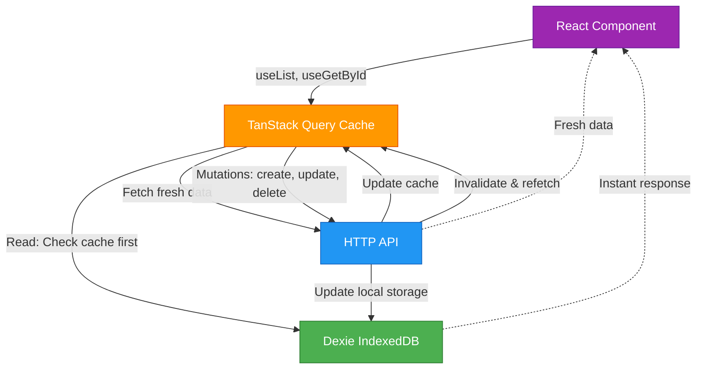

# @quantum/query

A unified query cache library for **local-first data fetching** with SWR (Stale-While-Revalidate) pattern using TanStack Query and Dexie (IndexedDB).

## Overview

`@quantum/query` provides instant, offline-first data access for React applications by combining IndexedDB local storage with intelligent background synchronization. Built on top of TanStack Query (React Query) and Dexie, it gives you the best of both worlds: lightning-fast UI updates from local cache and automatic background data freshness.

### Key Features

-   **Local-First Architecture** - Data reads from IndexedDB first for instant UI updates
-   **SWR Pattern** - Stale data served immediately while fresh data loads in background
-   **Automatic Sync** - Network requests update both local cache and React Query cache
-   **Type-Safe** - Full TypeScript support with generics and type inference
-   **React Hooks** - Powered by TanStack Query with auto-enabling queries
-   **Composite Keys** - Support for both simple (`id`) and composite primary keys
-   **Optimistic Updates** - Debounced mutations with two-tier persistence
-   **Zero Configuration** - Sensible defaults with optional customization

### Architecture



**Data Flow:**

1. **Read Path**: Query checks Dexie first → returns cached data instantly → fetches from API in background → updates caches
2. **Write Path**: Mutation updates API → invalidates query cache → background refetch updates Dexie

## Installation

```bash
pnpm add @sameera/quantum
```

### Peer Dependencies

This library requires:

-   `react` >= 18.0.0
-   `@tanstack/react-query` >= 5.0.0
-   `dexie` >= 3.0.0

These should already be installed in your project.

## Quick Start

### 1. Define Your Entity Type

```typescript
import type { BaseEntity } from "@sameera/quantum/query";

interface Space extends BaseEntity<string> {
    id: string;
    name: string;
    icon?: string;
    owner: { id: string };
}
```

### 2. Create a Resource

```typescript
import { query } from "@sameera/quantum/query";

// Create resource (synchronous)
export const spaces = query.createResource<Space>({
    name: "spaces",
    baseUrl: "/v1/spaces",
});
```

### 3. Initialize the Database

```typescript
// In your app initialization (e.g., main.tsx or App.tsx)
import { query } from "@sameera/quantum/query";

async function initializeApp() {
    await query.initialize(); // Creates all IndexedDB tables
}

initializeApp();
```

### 4. Use in React Components

```typescript
function SpacesList() {
    // Auto-enabled when all params are defined
    const { data: spaces, isLoading } = spaces.useList();

    if (isLoading) return <div>Loading...</div>;

    return (
        <ul>
            {spaces?.map((space) => (
                <li key={space.id}>{space.name}</li>
            ))}
        </ul>
    );
}

function SpaceDetail({ spaceId }: { spaceId: string }) {
    // Auto-enabled when spaceId is defined
    const { data: space } = spaces.useGetById(spaceId);
    const updateSpace = spaces.useUpdate();

    const handleRename = (newName: string) => {
        updateSpace.mutate({
            id: spaceId,
            data: { name: newName },
        });
    };

    if (!space) return null;

    return (
        <div>
            <h1>{space.name}</h1>
            <button onClick={() => handleRename("New Name")}>Rename</button>
        </div>
    );
}
```

## Core Concepts

### Local-First Architecture

The library prioritizes local data for instant UI updates:

1. **First render**: Data from IndexedDB (Dexie) shows immediately
2. **Background fetch**: Network request fires to get fresh data
3. **Cache update**: Both Dexie and TanStack Query caches update
4. **UI refresh**: Component re-renders with fresh data

This means your UI is never blocked waiting for network requests.

### SWR (Stale-While-Revalidate) Pattern

SWR is a data fetching strategy that:

-   Serves stale data from cache immediately (fast)
-   Revalidates data in the background (fresh)
-   Updates UI when fresh data arrives (automatic)

Perfect for building responsive UIs that feel instant while staying synchronized.

### Two-Phase Initialization

The library uses a two-phase initialization system for efficiency:

```typescript
// Phase 1: Create resources (synchronous, no I/O)
const users = query.createResource<User>({
    name: "users",
    baseUrl: "/api/users",
});
const posts = query.createResource<Post>({
    name: "posts",
    baseUrl: "/api/posts",
});

// Phase 2: Initialize database (async, single batch operation)
await query.initialize();
```

This allows you to create all resources at module level while deferring database initialization to app startup.

### Simple vs Composite Keys

**Simple Keys (default)**: Use the `id` field

```typescript
interface User extends BaseEntity<string> {
    id: string;
    name: string;
}

const users = query.createResource<User>({
    name: "users",
    baseUrl: "/api/users",
    // keyFields omitted - defaults to ["id"]
});

// URLs: /api/users/{id}
await users.getById("user123");
```

**Composite Keys**: Specify multiple key fields

```typescript
interface Tag extends BaseEntity<{ spaceId: string; name: string }> {
    spaceId: string;
    name: string;
    color?: string;
}

const tags = query.createResource<Tag, { spaceId: string; name: string }>({
    name: "tags",
    baseUrl: "/v1/tags",
    keyFields: ["spaceId", "name"],
});

// URLs: /v1/tags/{spaceId}/{name}
await tags.getById({ spaceId: "space123", name: "urgent" });
```

## API Reference

### Query Class

#### `new Query()`

Creates a new query cache instance. Most apps should use the singleton `query` export instead.

```typescript
import { query } from "@sameera/quantum/query";
// or
import { Query } from "@sameera/quantum/query";
const customQuery = new Query();
```

#### `query.createResource<T, ID>(config: ResourceConfig<T, ID>): ResourceAPI<T, ID>`

Creates a fully-featured resource API with CRUD operations, React hooks, and cache management.

**Parameters:**

-   `config.name` - Unique resource name (used for table name and query keys)
-   `config.baseUrl` - Base URL for REST API endpoints (e.g., `/api/users`)
-   `config.keyFields` - Optional array of field names for composite primary key

**Returns:** `ResourceAPI<T, ID>` with operations, hooks, and cache methods

```typescript
const spaces = query.createResource<Space>({
    name: "spaces",
    baseUrl: "/v1/spaces",
});
```

#### `query.initialize(): Promise<void>`

Initializes the IndexedDB database by creating all registered tables in a single batch operation. Call this once during app initialization after creating all resources.

```typescript
await query.initialize();
```

#### `query.getTable<T, ID>(name: string): Table<T, ID> | undefined`

Gets the Dexie table for a resource. Useful for advanced Dexie operations.

```typescript
const spacesTable = query.getTable<Space>("spaces");
const allSpaces = await spacesTable?.toArray();
```

### ResourceConfig

Configuration object for creating a resource.

```typescript
interface ResourceConfig<T, ID = string> {
    name: string; // Unique name for the resource
    baseUrl: string; // Base URL for REST API
    keyFields?: string[]; // Optional: fields forming composite key
}
```

### ResourceAPI

Complete API returned by `createResource()`. Includes all operations, hooks, and cache methods.

```typescript
interface ResourceAPI<T, ID = string> {
    // Metadata
    name: string;
    table: Table<T, ID>;
    queryKeys: QueryKeys<T, ID>;

    // CRUD Operations (Promise-based)
    getById(id: ID): Promise<T | null>;
    list(params?: ListParams): Promise<T[]>;
    create(data: Omit<T, keyof ID>): Promise<T>;
    update(id: ID, data: Partial<Omit<T, keyof ID>>): Promise<T>;
    remove(id: ID): Promise<void>;

    // React Hooks
    useGetById(id: ID | undefined, options?): UseQueryResult<T | undefined>;
    useList(params?: ListParams, options?): UseQueryResult<T[]>;
    useCreate(): UseMutationResult<T, Error, Omit<T, keyof ID>>;
    useUpdate(): UseMutationResult<T, Error, { id: ID; data: Partial<T> }>;
    useDelete(): UseMutationResult<void, Error, ID>;

    // Cache Operations
    seedOne(item: T): Promise<void>;
    seedMany(items: T[], params?: ListParams): Promise<void>;
    clearCache(): Promise<void>;
}
```

## CRUD Operations

All operations return Promises and can be used outside React components (e.g., in services, utilities, or scripts).

### `getById(id: ID): Promise<T | null>`

Fetch a single item by ID. Checks Dexie cache first, then fetches from API if needed.

```typescript
const space = await spaces.getById("space123");
if (space) {
    console.log(space.name);
}
```

### `list(params?: ListParams): Promise<T[]>`

Fetch a list of items with optional query parameters.

```typescript
// All items
const allSpaces = await spaces.list();

// With filters
const mySpaces = await spaces.list({ owner: userId });
```

**ListParams**: Record of query parameters (strings, numbers, booleans, arrays, or undefined)

### `create(data: Omit<T, keyof ID>): Promise<T>`

Create a new item. The server should return the created item with ID.

```typescript
const newSpace = await spaces.create({
    name: "My Workspace",
    icon: "briefcase",
    owner: { id: userId },
});
```

### `update(id: ID, data: Partial<Omit<T, keyof ID>>): Promise<T>`

Update an existing item. Returns the updated item.

```typescript
const updated = await spaces.update("space123", {
    name: "Renamed Workspace",
});
```

### `remove(id: ID): Promise<void>`

Delete an item.

```typescript
await spaces.remove("space123");
```

## React Hooks

All hooks are powered by TanStack Query and include automatic cache management.

### `useGetById(id, options?)`

Fetch a single item by ID with auto-enabling.

**Auto-enabling**: Query is automatically enabled when `id !== undefined` (unless `options.enabled` is explicitly set).

```typescript
function SpaceDetail({ spaceId }: { spaceId?: string }) {
    // Auto-enabled when spaceId is defined
    const { data: space, isLoading, error } = spaces.useGetById(spaceId);

    if (isLoading) return <div>Loading...</div>;
    if (error) return <div>Error: {error.message}</div>;
    if (!space) return <div>Not found</div>;

    return <h1>{space.name}</h1>;
}
```

**With custom options:**

```typescript
const { data: space } = spaces.useGetById(spaceId, {
    enabled: spaceId !== undefined && userCanView,
    staleTime: 5000,
    refetchOnWindowFocus: false,
});
```

### `useList(params?, options?)`

Fetch a list of items with auto-enabling.

**Auto-enabling**: Query is automatically enabled when all params are defined (unless `options.enabled` is explicitly set).

```typescript
function SpacesList({ userId }: { userId?: string }) {
    // Auto-enabled when userId is defined
    const { data: spaces = [], isLoading } = spaces.useList({
        owner: userId,
    });

    if (isLoading) return <div>Loading...</div>;

    return (
        <ul>
            {spaces.map((space) => (
                <li key={space.id}>{space.name}</li>
            ))}
        </ul>
    );
}
```

**With custom options:**

```typescript
const { data: spaces = [] } = spaces.useList(
    { owner: userId },
    {
        enabled: userId !== undefined && isReady,
        staleTime: 10000,
    }
);
```

### `useCreate()`

Create mutation hook with automatic cache invalidation.

```typescript
function CreateSpaceForm() {
    const createSpace = spaces.useCreate();

    const handleSubmit = (name: string) => {
        createSpace.mutate(
            { name, owner: { id: userId } },
            {
                onSuccess: (newSpace) => {
                    console.log("Created:", newSpace.id);
                },
                onError: (error) => {
                    console.error("Failed:", error.message);
                },
            }
        );
    };

    return (
        <form
            onSubmit={(e) => {
                e.preventDefault();
                handleSubmit(e.currentTarget.spaceName.value);
            }}>
            <input name="spaceName" />
            <button disabled={createSpace.isPending}>
                {createSpace.isPending ? "Creating..." : "Create"}
            </button>
        </form>
    );
}
```

### `useUpdate()`

Update mutation hook with automatic cache invalidation.

```typescript
function RenameSpace({ spaceId }: { spaceId: string }) {
    const updateSpace = spaces.useUpdate();

    const handleRename = (newName: string) => {
        updateSpace.mutate(
            { id: spaceId, data: { name: newName } },
            {
                onSuccess: () => console.log("Renamed successfully"),
            }
        );
    };

    return <button onClick={() => handleRename("New Name")}>Rename</button>;
}
```

### `useDelete()`

Delete mutation hook with automatic cache invalidation.

```typescript
function DeleteSpaceButton({ spaceId }: { spaceId: string }) {
    const deleteSpace = spaces.useDelete();

    return (
        <button
            onClick={() => deleteSpace.mutate(spaceId)}
            disabled={deleteSpace.isPending}>
            {deleteSpace.isPending ? "Deleting..." : "Delete"}
        </button>
    );
}
```

## Cache Operations

Manage the local cache manually when needed.

### `seedOne(item: T): Promise<void>`

Pre-populate cache with a single item. Updates both Dexie and React Query cache.

```typescript
// After external data fetch or SSR
const initialSpace = await fetchSpaceFromServer();
await spaces.seedOne(initialSpace);
```

### `seedMany(items: T[], params?: ListParams): Promise<void>`

Pre-populate cache with multiple items. Updates both Dexie and React Query cache.

```typescript
// Seed initial data
const initialSpaces = await fetchInitialSpaces();
await spaces.seedMany(initialSpaces);

// Seed with params (for specific list query)
await spaces.seedMany(mySpaces, { owner: userId });
```

### `clearCache(): Promise<void>`

Clear all cached data for this resource. Removes from both Dexie and React Query.

```typescript
// On logout
await spaces.clearCache();
await users.clearCache();
```

## Advanced Features

### Debounced Updates

For high-frequency updates (text editors, drag-and-drop), use `useDebouncedUpdate` to optimize API calls while maintaining data safety.

```typescript
import { useDebouncedUpdate } from "@sameera/quantum/query";

function NoteEditor({ noteId }: { noteId: string }) {
    const [content, setContent] = useState("");

    // Immediate IndexedDB save, 1-second debounced API sync
    const { debouncedUpdate, flush } = useDebouncedUpdate(notes, 1000);

    const handleChange = async (newContent: string) => {
        setContent(newContent);
        // Saves to IndexedDB immediately, syncs to API after 1 second of inactivity
        await debouncedUpdate(noteId, { content: newContent });
    };

    // Force immediate sync before unmount
    useEffect(() => {
        return () => {
            flush();
        };
    }, [flush]);

    return (
        <textarea
            value={content}
            onChange={(e) => handleChange(e.target.value)}
        />
    );
}
```

**How it works:**

1. **Immediate IndexedDB save** - Data persisted locally instantly (no data loss)
2. **Debounced API sync** - Server updates batched to reduce API load
3. **Auto-flush on unmount** - Ensures pending updates sync before component cleanup

**When to use:**

-   Text editors (typing) → 1000ms debounce
-   Drag-and-drop interfaces → 300ms debounce
-   Form inputs with auto-save → 500ms debounce

### Composite Keys

Use composite keys when entities are uniquely identified by multiple fields.

```typescript
interface CategoryTag {
    category: { id: string };
    tag: { id: string };
    createdAt: string;
}

const categoryTags = query.createResource<
    CategoryTag,
    { category: string; tag: string }
>({
    name: "categoryTags",
    baseUrl: "/v1/category-tags",
    keyFields: ["category", "tag"],
});

// URLs: /v1/category-tags/{category}/{tag}
const tag = await categoryTags.getById({
    category: "cat123",
    tag: "tag456",
});

// Nested objects are flattened automatically for Dexie
await categoryTags.create({
    category: { id: "cat123" }, // Flattened to 'cat123' in IndexedDB
    tag: { id: "tag456" }, // Flattened to 'tag456' in IndexedDB
    createdAt: new Date().toISOString(),
});
```

### Query Key Factory

Each resource has a hierarchical query key factory for efficient cache invalidation.

```typescript
const { queryKeys } = spaces;

queryKeys.all; // ['spaces']
queryKeys.lists(); // ['spaces', 'list']
queryKeys.list({ owner: "u1" }); // ['spaces', 'list', { owner: 'u1' }]
queryKeys.detail("space123"); // ['spaces', 'detail', 'space123']
```

**Manual invalidation:**

```typescript
import { queryClient } from "@sameera/quantum/query";

// Invalidate all spaces queries
await queryClient.invalidateQueries({ queryKey: spaces.queryKeys.all });

// Invalidate specific list
await queryClient.invalidateQueries({
    queryKey: spaces.queryKeys.list({ owner: userId }),
});

// Invalidate single item
await queryClient.invalidateQueries({
    queryKey: spaces.queryKeys.detail("space123"),
});
```

### Custom Query Options

All hooks accept TanStack Query options for fine-grained control.

```typescript
const { data: space } = spaces.useGetById(spaceId, {
    staleTime: 5 * 60 * 1000, // Consider fresh for 5 minutes
    cacheTime: 10 * 60 * 1000, // Keep in cache for 10 minutes
    refetchOnWindowFocus: false, // Don't refetch on tab focus
    refetchOnReconnect: true, // Refetch on network reconnect
    retry: 3, // Retry failed requests 3 times
    enabled: userIsAuthenticated, // Conditional fetching
});
```

## Type System

### BaseEntity<ID>

Base type for entities with simple or composite keys.

```typescript
// Simple key (default)
interface User extends BaseEntity<string> {
    id: string;
    name: string;
}

// Composite key
interface Tag extends BaseEntity<{ spaceId: string; name: string }> {
    spaceId: string;
    name: string;
}
```

### FlattenRefs<T>

Type utility that shallowly flattens nested reference objects to `{ id: ... }`.

```typescript
interface Tag {
    name: string;
    space: { id: string; name: string };
    createdBy: { id: number; email: string };
}

type FlatTag = FlattenRefs<Tag>;
// Result:
// {
//   name: string;
//   space: { id: string };
//   createdBy: { id: number };
// }
```

**Use case:** When creating/updating entities, you only need to provide IDs for references:

```typescript
tags.create({
    name: "urgent",
    space: { id: "space123" }, // Don't need full space object
    createdBy: { id: currentUserId }, // Don't need full user object
});
```

### DeepFlattenRefs<T>

Type utility that recursively flattens all nested references to `{ id: ... }`.

```typescript
interface Tag {
    name: string;
    space: {
        id: string;
        owner: { id: number; fullName: string };
    };
    children: Array<{ id: string; label: string }>;
}

type DeepFlatTag = DeepFlattenRefs<Tag>;
// Result:
// {
//   name: string;
//   space: { id: string };                // Full object collapsed
//   children: Array<{ id: string }>;      // Array elements collapsed
// }
```

### ListParams

Type for query parameters in list operations.

```typescript
type ListParams = Record<
    string,
    string | number | boolean | string[] | undefined
>;

// Examples
spaces.list({ owner: userId }); // string
spaces.list({ limit: 10, offset: 0 }); // number
spaces.list({ includeArchived: true }); // boolean
spaces.list({ tags: ["work", "urgent"] }); // string[]
spaces.list({ search: searchTerm || undefined }); // undefined
```

## API Response Format Requirements

All backend APIs that integrate with this library **must** follow a standardized response format to ensure compatibility with the client-side query operations.

### HTTP Status Code Requirements

APIs must use proper HTTP status codes to indicate success or failure:

-   **2xx Success**: Request succeeded, return `{ data: T | T[] }`
-   **4xx Client Error**: Invalid request, authentication/authorization failure, resource not found
-   **5xx Server Error**: Unexpected server error

**The client library (`apiRequest`) throws an `ApiError` for all non-2xx responses**, so backend services should throw errors instead of returning error objects in the response body.

### Required Response Structure

#### Success Responses (HTTP 2xx)

##### Single Resource Endpoints (GET, POST, PATCH)

```typescript
{
    data: T; // The resource object
}
```

**Example (HTTP 200):**

```json
{
    "data": {
        "id": "abc123...",
        "name": "My Space",
        "owner": { "id": "user123" }
    }
}
```

##### Collection Endpoints (GET /resources)

```typescript
{
  data: T[]            // Array of resources
}
```

**Example (HTTP 200):**

```json
{
    "data": [
        {
            "id": "abc123...",
            "name": "Space 1",
            "owner": { "id": "user123" }
        },
        {
            "id": "def456...",
            "name": "Space 2",
            "owner": { "id": "user456" }
        }
    ]
}
```

#### Error Responses (HTTP 4xx, 5xx)

When errors occur, throw appropriate HTTP errors with error details in the response body:

```typescript
{
  error: {
    code: string;       // Machine-readable error code
    message: string;    // Human-readable error message
    details?: string;   // Optional additional details
  }
}
```

**Example (HTTP 404):**

```json
{
    "error": {
        "code": "SPACE_NOT_FOUND",
        "message": "Space not found or you do not have access"
    }
}
```

**Example (HTTP 400):**

```json
{
    "error": {
        "code": "INVALID_CAS_KEY",
        "message": "The provided space ID does not match the expected CAS key",
        "details": "Space ID validation failed"
    }
}
```

### Key Points

1. **Use HTTP status codes** - Throw errors with appropriate status codes (400, 401, 403, 404, 409, 500) instead of returning HTTP 200 with error objects

2. **Success responses use `data` wrapper** - Always use `data` as the property name, not resource-specific names like `space`, `spaces`, `categories`

3. **Error responses use `error` object** - Use singular `error` (not `errors` array) with `code`, `message`, and optional `details`

4. **Client handles errors automatically** - The `apiRequest` function throws `ApiError` for non-2xx responses, which is caught by the query library

5. **DELETE operations** - DELETE endpoints return HTTP 204 No Content with no response body

### Examples by HTTP Method and Status Code

```typescript
// GET /spaces/:id
// Success (200): { data: Space }
// Not Found (404): { error: { code: "SPACE_NOT_FOUND", message: "..." } }
// Access Denied (403): { error: { code: "ACCESS_DENIED", message: "..." } }

// POST /spaces
// Success (200): { data: Space }
// Bad Request (400): { error: { code: "INVALID_CAS_KEY", message: "..." } }
// Conflict (409): { error: { code: "SPACE_ALREADY_EXISTS", message: "..." } }

// PATCH /spaces/:id
// Success (200): { data: Space }
// Not Found (404): { error: { code: "SPACE_NOT_FOUND", message: "..." } }

// GET /spaces
// Success (200): { data: Space[] }
// Empty result: { data: [] } (still HTTP 200)

// DELETE /spaces/:id
// Success: HTTP 204 No Content (no body)
// Not Found (404): { error: { code: "SPACE_NOT_FOUND", message: "..." } }
```

### TypeScript Types

When defining response DTOs in your backend, follow this pattern:

```typescript
// Success response - single resource
export interface ResourceResponseDto {
    data: ResourceDto;
}

// Success response - collection
export interface ResourcesResponseDto {
    data: ResourceDto[];
}

// Error response (thrown, not returned)
export class ResourceNotFoundError extends NotFoundError {
    constructor(message: string = "Resource not found") {
        super(message, "RESOURCE_NOT_FOUND");
    }
}
```

### Backend Implementation Pattern

```typescript
// Service layer - throw errors
async getById(id: string): Promise<ResourceDto> {
  const resource = await db.findById(id);
  if (!resource) {
    throw new NotFoundError("Resource not found", "RESOURCE_NOT_FOUND");
  }
  return resource;
}

// Handler layer - catch errors and set status codes
async handler(request, reply) {
  try {
    const resource = await service.getById(id);
    return reply.status(200).send({ data: resource });
  } catch (error) {
    if (error instanceof NotFoundError) {
      return reply.status(404).send({
        error: {
          code: error.code,
          message: error.message,
          details: error.details
        }
      });
    }
    throw error; // Let global error handler deal with unexpected errors
  }
}
```

## Best Practices

### When to Use Debounced Updates

Use `useDebouncedUpdate` for high-frequency updates:

-   ✅ Text editors, rich text editors
-   ✅ Drag-and-drop interfaces
-   ✅ Canvas/drawing applications
-   ✅ Form auto-save
-   ❌ Button clicks (use regular mutations)
-   ❌ Form submissions (use regular mutations)

### Performance Optimization

**Stale time**: Configure how long data is considered fresh

```typescript
// Don't refetch for 5 minutes
const { data } = spaces.useGetById(id, { staleTime: 5 * 60 * 1000 });
```

**Disable unnecessary refetches:**

```typescript
const { data } = spaces.useList(params, {
    refetchOnWindowFocus: false, // Static data
    refetchOnReconnect: false, // Data doesn't change server-side
});
```

**Prefetch data:**

```typescript
import { queryClient } from "@sameera/quantum/query";

// Prefetch on hover
const handleMouseEnter = () => {
    queryClient.prefetchQuery({
        queryKey: spaces.queryKeys.detail(spaceId),
        queryFn: () => spaces.getById(spaceId),
    });
};
```

### Error Handling

**Component-level:**

```typescript
const { data, error, isError } = spaces.useGetById(id);

if (isError) {
    return <ErrorMessage error={error} />;
}
```

**Mutation callbacks:**

```typescript
const createSpace = spaces.useCreate();

createSpace.mutate(data, {
    onSuccess: (newSpace) => {
        toast.success("Space created!");
        navigate(`/spaces/${newSpace.id}`);
    },
    onError: (error) => {
        if (error.message.includes("DUPLICATE")) {
            toast.error("A space with this name already exists");
        } else {
            toast.error("Failed to create space");
        }
    },
});
```

### Testing Strategies

**Mock the resource:**

```typescript
import { vi } from "vitest";
import { spaces } from "./resources";

vi.mock("./resources", () => ({
    spaces: {
        useGetById: vi.fn(() => ({
            data: mockSpace,
            isLoading: false,
            error: null,
        })),
    },
}));
```

**Provide test query client:**

```typescript
import { QueryClient, QueryClientProvider } from "@tanstack/react-query";

function renderWithQuery(ui: React.ReactElement) {
    const queryClient = new QueryClient({
        defaultOptions: {
            queries: { retry: false },
            mutations: { retry: false },
        },
    });

    return render(
        <QueryClientProvider client={queryClient}>{ui}</QueryClientProvider>
    );
}
```

## Complete Examples

### Todo App

```typescript
// types.ts
interface Todo extends BaseEntity<string> {
    id: string;
    title: string;
    completed: boolean;
    userId: string;
}

// resources.ts
import { query } from "@sameera/quantum/query";

export const todos = query.createResource<Todo>({
    name: "todos",
    baseUrl: "/api/todos",
});

// Initialize in main.tsx
await query.initialize();

// TodoList.tsx
function TodoList({ userId }: { userId: string }) {
    const { data: todos = [], isLoading } = todos.useList({ userId });
    const createTodo = todos.useCreate();
    const updateTodo = todos.useUpdate();
    const deleteTodo = todos.useDelete();

    const handleAdd = (title: string) => {
        createTodo.mutate({ title, completed: false, userId });
    };

    const handleToggle = (todo: Todo) => {
        updateTodo.mutate({
            id: todo.id,
            data: { completed: !todo.completed },
        });
    };

    if (isLoading) return <div>Loading...</div>;

    return (
        <div>
            <TodoForm onSubmit={handleAdd} />
            <ul>
                {todos.map((todo) => (
                    <li key={todo.id}>
                        <input
                            type="checkbox"
                            checked={todo.completed}
                            onChange={() => handleToggle(todo)}
                        />
                        <span>{todo.title}</span>
                        <button onClick={() => deleteTodo.mutate(todo.id)}>
                            Delete
                        </button>
                    </li>
                ))}
            </ul>
        </div>
    );
}
```

### Multi-Tenant Tag System (Composite Keys)

```typescript
// types.ts
interface Tag extends BaseEntity<{ spaceId: string; name: string }> {
    spaceId: string;
    name: string;
    color: string;
}

// resources.ts
export const tags = query.createResource<
    Tag,
    { spaceId: string; name: string }
>({
    name: "tags",
    baseUrl: "/v1/tags",
    keyFields: ["spaceId", "name"],
});

// TagManager.tsx
function TagManager({ spaceId }: { spaceId: string }) {
    const { data: tags = [] } = tags.useList({ space: spaceId });
    const createTag = tags.useCreate();
    const updateTag = tags.useUpdate();

    const handleCreate = (name: string, color: string) => {
        createTag.mutate({ spaceId, name, color });
    };

    const handleUpdateColor = (tagName: string, newColor: string) => {
        updateTag.mutate({
            id: { spaceId, name: tagName },
            data: { color: newColor },
        });
    };

    return (
        <div>
            {tags.map((tag) => (
                <TagBadge
                    key={tag.name}
                    tag={tag}
                    onColorChange={(color) =>
                        handleUpdateColor(tag.name, color)
                    }
                />
            ))}
        </div>
    );
}
```

## Running Tests

Run `nx test @quantum/query` to execute the unit tests via [Vitest](https://vitest.dev/).
